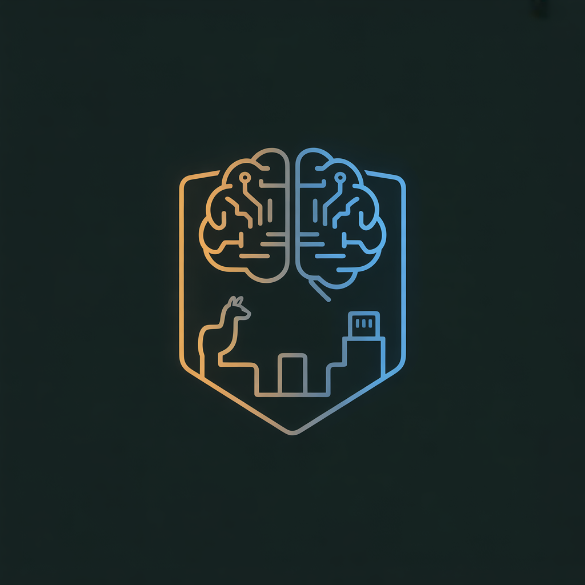

# AI Survival



A fully offline, portable AI assistant on an external HDD/USB. Plug it into any machine, run one script, and chat with a local LLM through a browser-based UI. No internet required after initial setup.

## How It Works

- **llama.cpp** runs the LLM inference (OpenAI-compatible API)
- **Open WebUI** provides the browser chat interface
- **Docker Compose** or **local Python** serves both components
- **GGUF models** are stored on the HDD, loaded at startup

Two deployment modes — choose what suits your target machine:

| Mode       | Requires             | Command                    |
| ---------- | -------------------- | -------------------------- |
| **Docker** | Docker Engine 20.10+ | `./scripts/start.sh`       |
| **Local**  | Python 3.11+         | `./scripts/start-local.sh` |

```
External HDD
├── llama.cpp server  ←── serves the model (Docker or local binary)
├── Open WebUI        ←── chat UI at localhost:3000
└── models/*.gguf     ←── offline model files
```

---

## Quick Start

### 1. First-time setup

```bash
# Linux / macOS
./scripts/setup.sh

# Windows
scripts\setup.bat
```

You will be prompted to choose **Docker** or **Local** mode. You can also skip the prompt:

```bash
./scripts/setup.sh --docker    # Docker mode
./scripts/setup.sh --local     # Local mode (no Docker)
```

### 2. Download a model (requires internet, one-time)

```bash
./scripts/download-models.sh
```

### 3. Start

```bash
# Linux / macOS
./scripts/start.sh              # Docker mode
./scripts/start-local.sh        # Local mode

# Windows
scripts\start.bat               # Docker mode
scripts\start-local.bat         # Local mode
```

Open **http://localhost:3000** and start chatting.

### Stop

```bash
./scripts/stop.sh               # Docker mode
./scripts/stop-local.sh         # Local mode
scripts\stop.bat                # Windows Docker
scripts\stop-local.bat          # Windows Local
```

---

## Hardware Requirements

| Component | Minimum                       | Recommended                       |
| --------- | ----------------------------- | --------------------------------- |
| RAM       | 4 GB                          | 16 GB                             |
| Storage   | 32 GB (system + 1 model)      | 128 GB (multiple models)          |
| CPU       | Any modern x86_64             | Multi-core for faster inference   |
| GPU       | Not required                  | NVIDIA with CUDA for acceleration |
| Docker    | Engine 20.10+ _(Docker mode)_ | Docker Desktop (Win/Mac)          |
| Python    | 3.11+ _(Local mode)_          | —                                 |

---

## Available Models

| Model                 | Size    | Best For                         |
| --------------------- | ------- | -------------------------------- |
| TinyLlama 1.1B        | ~669 MB | Low-RAM systems, quick testing   |
| Phi-3 Mini 3.8B       | ~2.4 GB | Good quality, moderate resources |
| Mistral 7B Instruct   | ~4.4 GB | Strong general-purpose           |
| Llama 3.1 8B Instruct | ~4.9 GB | Best quality                     |

Download interactively:

```bash
./scripts/download-models.sh          # Interactive menu
./scripts/download-models.sh --list   # List available models
```

Switch between downloaded models:

```bash
./scripts/switch-model.sh
```

---

## GPU Acceleration (Docker mode)

For NVIDIA GPUs with CUDA:

```bash
./scripts/start.sh --gpu
```

Set `GPU_LAYERS=-1` in `.env` to offload all layers to GPU. Requires [NVIDIA Container Toolkit](https://docs.nvidia.com/datacenter/cloud-native/container-toolkit/install-guide.html).

---

## Docker Not Installed?

If the target machine doesn't have Docker, you can download the installer in advance:

```bash
./scripts/download-docker.sh             # Current platform
./scripts/download-docker.sh --all       # All platforms
./scripts/download-docker.sh --list      # List already downloaded
```

Installers are saved to `installers/docker/`:

| Platform    | File                                                         |
| ----------- | ------------------------------------------------------------ |
| Windows     | `installers/docker/windows/DockerDesktopInstaller.exe`       |
| macOS Intel | `installers/docker/macos/DockerDesktop-Intel.dmg`            |
| macOS ARM   | `installers/docker/macos/DockerDesktop-ARM.dmg`              |
| Linux       | `installers/docker/linux/docker-*-static-x64.tgz` (+ README) |

The `setup.sh` script will detect missing Docker and point you to these files automatically — it does **not** block or exit if Docker is absent.

---

## Local Mode (No Docker)

Local mode runs llama.cpp and Open WebUI as native processes on the host.

### Install

```bash
./scripts/install-local.sh           # Linux/macOS
scripts\install-local.bat             # Windows
./scripts/install-local.sh --check   # Check what is already installed
```

This:

1. Downloads and extracts the llama.cpp pre-built binary for your platform
2. Creates a Python venv at `data/webui-venv/` and installs Open WebUI
3. Creates `.env.local` with local-mode settings

### Offline pre-caching

For fully offline local install, pre-download files before copying to the HDD:

| File                      | Cache location                        |
| ------------------------- | ------------------------------------- |
| llama.cpp zip for Linux   | `installers/local/llama-cpp/linux/`   |
| llama.cpp zip for macOS   | `installers/local/llama-cpp/macos/`   |
| llama.cpp zip for Windows | `installers/local/llama-cpp/windows/` |
| Open WebUI wheels         | `installers/local/open-webui/`        |

`install-local.sh` checks these directories first before attempting to download.

---

## Offline Deployment

See [OFFLINE.md](OFFLINE.md) for the full guide — preparation, deployment, troubleshooting, and updating.

Summary:

1. **Prepare** (online): download models, build/save Docker images or cache local binaries
2. **Copy** the entire `AI_Survival/` directory to the external HDD
3. **Deploy** (offline): plug in, run `setup.sh`, then `start.sh` or `start-local.sh`

---

## Configuration

Docker-mode settings are in `.env`:

| Variable        | Default                                | Description                |
| --------------- | -------------------------------------- | -------------------------- |
| `DEFAULT_MODEL` | `tinyllama-1.1b-chat-v1.0.Q4_K_M.gguf` | Active model filename      |
| `WEBUI_PORT`    | `3000`                                 | Open WebUI port            |
| `LLAMA_PORT`    | `8080`                                 | llama.cpp API port         |
| `CONTEXT_SIZE`  | `4096`                                 | Context window (tokens)    |
| `GPU_LAYERS`    | `0`                                    | GPU layers (0=CPU, -1=all) |
| `THREADS`       | `0`                                    | CPU threads (0=auto)       |
| `BATCH_SIZE`    | `512`                                  | Prompt batch size          |

Local-mode settings are in `.env.local` (created by `install-local.sh`). It uses the same variable names.

---

## Adding Custom Models

1. Download any GGUF model from [Hugging Face](https://huggingface.co/models?sort=trending&search=gguf)
2. Place the `.gguf` file in the `models/` directory
3. Switch to it: `./scripts/switch-model.sh <filename.gguf>`

See [models/README.md](models/README.md) for more details.

---

## Validation

Run the pre-deployment checklist:

```bash
./scripts/validate.sh
```

Checks project structure, configs, models, Docker images, and system requirements.

---

## Scripts Reference

| Script                                       | Description                                         |
| -------------------------------------------- | --------------------------------------------------- |
| `setup.sh` / `setup.bat`                     | First-time setup — prompts for Docker or Local mode |
| `start.sh` / `start.bat`                     | Start Docker stack (add `--gpu` for CUDA)           |
| `stop.sh` / `stop.bat`                       | Stop Docker stack                                   |
| `start-local.sh` / `start-local.bat`         | Start local stack (no Docker)                       |
| `stop-local.sh` / `stop-local.bat`           | Stop local stack                                    |
| `install-local.sh` / `install-local.bat`     | Install llama.cpp + Open WebUI locally              |
| `download-docker.sh` / `download-docker.bat` | Download Docker installers for offline use          |
| `download-models.sh`                         | Download GGUF models interactively                  |
| `switch-model.sh`                            | Switch the active model                             |
| `save-images.sh`                             | Export Docker images as tars for offline use        |
| `validate.sh`                                | Pre-deployment validation checklist                 |

---

## FAQ

**Q: Do I need internet to use this?**
No. Once the HDD is prepared (models downloaded, Docker images or local binaries saved), everything runs offline.

**Q: Do I need Docker?**
No. Use `./scripts/setup.sh --local` for local mode — only Python 3.11+ is required.

**Q: What if Docker isn't installed on the target machine?**
Run `./scripts/download-docker.sh` on an internet-connected machine to save the Docker installer to `installers/docker/`. The setup script will find it and tell you where to run it.

**Q: How much RAM do I need?**
4 GB minimum (TinyLlama only). 8 GB for 3B–7B models. 16 GB for comfortable 8B usage.

**Q: Can I use my own models?**
Yes. Any GGUF model compatible with llama.cpp works. Drop it in `models/` and switch to it.

**Q: The server takes a long time to start.**
Large models (7B+) take 30–60 seconds to load on CPU. The start script waits up to 5 minutes.

- Docker: `docker logs -f ai-survival-llama`
- Local: `cat data/logs/llama-server.log`

**Q: Port 3000 or 8080 is already in use.**
Change `WEBUI_PORT` or `LLAMA_PORT` in `.env` (Docker) or `.env.local` (Local).

**Q: How do I update llama.cpp?**

- Docker: edit `LLAMA_CPP_VERSION` in `Dockerfile.llamacpp`, rebuild, re-export
- Local: edit `LLAMA_VERSION` in `install-local.sh`, delete `bin/llama-cpp/`, re-run `install-local.sh`

---

## Project Structure

```
AI_Survival/
├── Dockerfile.llamacpp          # llama.cpp server image (multi-stage build)
├── docker-compose.yml           # Docker orchestration
├── docker-compose.gpu.yml       # GPU override
├── .env                         # Docker-mode configuration
├── .env.local                   # Local-mode configuration (created by install-local.sh)
├── .dockerignore                # Build context exclusions
├── models/                      # GGUF model files
├── data/                        # Persistent data (WebUI DB, venv, logs, PIDs)
├── images/                      # Saved Docker image tars
├── installers/
│   ├── docker/                  # Docker installers for offline deployment
│   │   ├── windows/
│   │   ├── macos/
│   │   └── linux/
│   └── local/                   # Pre-cached binaries for local mode
│       ├── llama-cpp/
│       └── open-webui/
├── bin/                         # Extracted local binaries (created by install-local.sh)
├── config/                      # Server configuration reference
├── scripts/                     # All automation scripts
├── OFFLINE.md                   # Offline deployment guide
├── plan.md                      # Implementation plan
└── README.md                    # This file
```

---

## License

This project assembles open-source components. See individual model licenses in [models/README.md](models/README.md).

## Support This Project

If you find this useful, consider supporting its development. Your contributions help keep the project maintained, fund new features, and cover infrastructure costs.

### Donate

[](https://buymeacoffee.com/ashrafalnas)
[](https://www.patreon.com/cw/UnrealPatr)

| Platform            | Type                         | Link                                                                 |
| ------------------- | ---------------------------- | -------------------------------------------------------------------- |
| **Buy Me a Coffee** | One-time or monthly support  | [buymeacoffee.com/ashrafalnas](https://buymeacoffee.com/ashrafalnas) |
| **Patreon**         | Recurring monthly membership | [patreon.com/cw/UnrealPatr](https://www.patreon.com/cw/UnrealPatr)   |
